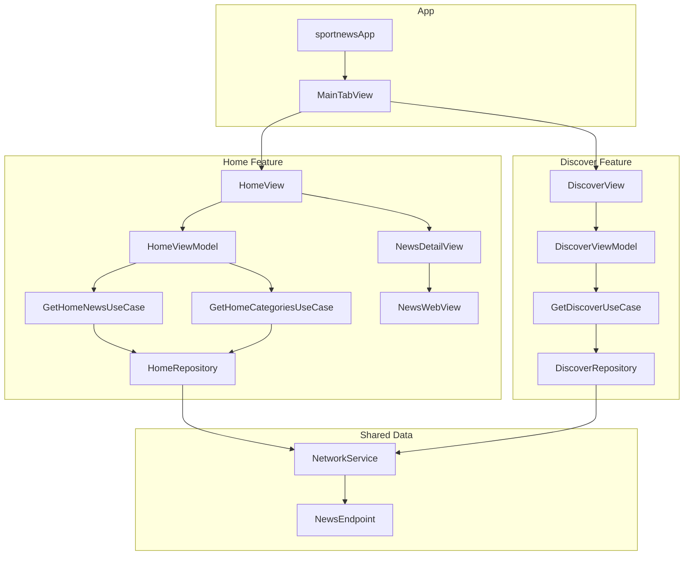

# SportNews — Cấu trúc & Kiến trúc dự án

Ứng dụng iOS đọc tin thể thao, xây dựng bằng **SwiftUI**, kết nối REST API tại `https://vn-sport-news.onrender.com`.

## Kiến trúc tổng quan

Dự án áp dụng **Clean Architecture** kết hợp **MVVM** ở tầng Presentation, chia thành 3 tầng rõ ràng:

```
┌─────────────────────────────────────────────────────────┐
│                    PRESENTATION                         │
│  SwiftUI Views  ←→  ViewModels (@MainActor, Combine)   │
└──────────────────────────┬──────────────────────────────┘
                           │ gọi UseCase
┌──────────────────────────▼──────────────────────────────┐
│                       DOMAIN                            │
│  Entities  ·  UseCases  ·  Repository Protocols         │
└──────────────────────────┬──────────────────────────────┘
                           │ implement protocol
┌──────────────────────────▼──────────────────────────────┐
│                        DATA                             │
│  Repositories  ·  DTOs  ·  NetworkService  ·  Endpoints │
└─────────────────────────────────────────────────────────┘
```

### Nguyên tắc phụ thuộc

- **Presentation** chỉ biết đến **Domain** (UseCase, Entity).
- **Domain** không phụ thuộc vào Data hay UI — chỉ định nghĩa protocol cho Repository.
- **Data** implement protocol từ Domain, map DTO → Entity trước khi trả về.

### Luồng dữ liệu (ví dụ: tải tin trang chủ)

```
HomeView
  → HomeViewModel.initializeHomeData()
    → GetHomeCategoriesUseCase.execute()
      → HomeRepository.getHomeCategories()
        → NetworkService.request(NewsEndpoint.getCategories)
          → GetCategoriesResponseDTO → map → [SportCategory]
    → GetHomeNewsUseCase.execute(page, category)
      → HomeRepository.getHomeNews()
        → NetworkService.request(NewsEndpoint.getNews)
          → GetNewsListResponseDTO → map → [SportNews]
```

### Dependency Injection

Hiện tại dùng **manual DI** trong `MainTabView`: khởi tạo Repository → UseCase → ViewModel → View tại `init()`. Chưa có DI container hay framework bên ngoài.

---

## Cấu trúc thư mục

```
sportnews/
├── sportnews.xcodeproj/          # Cấu hình Xcode project
│
└── sportnews/                    # Source code chính
    ├── Assets.xcassets/            # Icon, màu accent
    │
    ├── Domain/                     # Tầng nghiệp vụ (thuần Swift, không UI/network)
    │   ├── Entities/
    │   │   ├── SportNews.swift       # Model tin tức
    │   │   ├── SportCategory.swift   # Model danh mục
    │   │   └── DiscoverSection.swift # Nhóm tin theo section (Khám phá)
    │   ├── Repositories/
    │   │   ├── HomeRepositoryProtocol.swift
    │   │   └── DiscoverRepositoryProtocol.swift
    │   └── UseCases/
    │       ├── GetHomeNewsUseCase.swift
    │       ├── GetHomeCategoriesUseCase.swift
    │       └── GetDiscoverUseCase.swift
    │
    ├── Data/                       # Tầng dữ liệu (API, mapping)
    │   ├── Network/
    │   │   ├── APIEndpoint.swift     # Protocol endpoint + base URL
    │   │   └── NetworkService.swift  # URLSession, decode JSON
    │   └── News/
    │       ├── NewsEndpoint.swift    # Các endpoint cụ thể (news, categories, discover)
    │       ├── HomeRepository.swift
    │       ├── DiscoverRepository.swift
    │       └── DTOS/
    │           ├── GetNewsListResponseDTO.swift
    │           ├── GetCategoriesResponseDTO.swift
    │           └── GetDiscoverResponseDTO.swift
    │
    └── Presentation/               # Tầng giao diện (SwiftUI)
        ├── sportnewsApp.swift        # @main entry point
        ├── MainTabView.swift         # Tab bar + wiring DI
        ├── ContentView.swift         # (placeholder, chưa dùng)
        ├── Components/
        │   └── NewsWebView.swift     # WKWebView wrapper hiển thị bài viết
        ├── Home/
        │   ├── ViewModels/
        │   │   └── HomeViewModel.swift
        │   └── Views/
        │       ├── HomeView.swift
        │       └── NewsDetailView.swift
        └── Explore/
            ├── ViewModels/
            │   └── DiscoverViewModel.swift
            └── Views/
                └── DiscoverView.swift
```

---

## Chi tiết từng tầng

### 1. Presentation

| Thành phần | Vai trò |
|---|---|
| `SportNewsApp` | Entry point, mount `MainTabView` |
| `MainTabView` | 3 tab: Trang chủ, Khám phá, Cá nhân (placeholder) |
| `HomeView` + `HomeViewModel` | Danh sách tin, filter theo category, load more, pull-to-refresh |
| `DiscoverView` + `DiscoverViewModel` | Section ngang, search bar, quick tags |
| `NewsDetailView` | Full-screen modal, hiển thị bài qua `NewsWebView` |
| `NewsWebView` | `UIViewRepresentable` bọc `WKWebView` |

**Pattern MVVM:**
- ViewModel kế thừa `ObservableObject`, expose `@Published` state.
- View dùng `@ObservedObject` / `@StateObject`, gọi async method qua `.task` hoặc `Task {}`.
- ViewModel **không** gọi trực tiếp Repository — chỉ gọi UseCase.

### 2. Domain

| Thành phần | Vai trò |
|---|---|
| **Entities** | Model nghiệp vụ sạch, không phụ thuộc JSON hay UI |
| **Repository Protocols** | Hợp đồng trừu tượng cho Data layer |
| **UseCases** | Một action nghiệp vụ = một UseCase (lấy tin, lấy category, lấy discover) |

UseCase hiện tại chủ yếu **delegate** sang Repository; có thể mở rộng thêm logic filter/sort tại đây mà không ảnh hưởng UI.

### 3. Data

| Thành phần | Vai trò |
|---|---|
| `APIEndpoint` | Protocol chung: `baseURL`, `path`, `method`, `headers`, query/body |
| `NewsEndpoint` | Enum implement `APIEndpoint` cho 3 API |
| `NetworkService` | Build `URLRequest`, gọi `URLSession`, decode `Decodable`, log request/response |
| **DTOs** | Struct map 1:1 với JSON API, có hàm `toDomain()` / `toEntity()` |
| **Repositories** | Gọi network, map DTO → Entity, trả về cho UseCase |

#### API Endpoints

| Endpoint | Path | Mô tả |
|---|---|---|
| `getNews` | `GET /api/news` | Danh sách tin (phân trang, filter category) |
| `getCategories` | `GET /api/categories` | Danh mục tab trang chủ |
| `getDiscover` | `GET /api/discover` | Các section tin khám phá |

---

## Màn hình & tính năng hiện tại

### Tab Trang chủ (`HomeView`)
- App bar logo "SportNews"
- Tab ngang danh mục (API + tab "Tất cả" hardcode)
- Banner tin nổi bật (item đầu tiên)
- Danh sách tin dạng card
- Infinite scroll (load more khi gần cuối danh sách)
- Pull-to-refresh
- Tap tin → `NewsDetailView` (WebView)

### Tab Khám phá (`DiscoverView`)
- Thanh tìm kiếm (UI only, chưa gọi API)
- Quick tags hardcode
- Các section cuộn ngang theo dữ liệu API
- Tap tin → `NewsDetailView`

### Tab Cá nhân
- Placeholder `Text("Màn hình cá nhân")` — chưa implement.

---

## Công nghệ sử dụng

| Công nghệ | Mục đích |
|---|---|
| SwiftUI | UI declarative |
| Combine | Reactive state (`@Published`, `ObservableObject`) |
| async/await | Gọi API bất đồng bộ |
| URLSession | HTTP client |
| WKWebView (UIKit bridge) | Đọc bài viết gốc |

---

## Điểm mạnh & hướng mở rộng

### Điểm mạnh
- Tách layer rõ ràng, dễ test UseCase/Repository độc lập.
- Protocol-based giúp mock network khi viết unit test.
- DTO mapping tập trung, Domain Entity không bị "ô nhiễm" bởi JSON.

### Có thể cải thiện
- **DI**: chuyển sang factory/container thay vì wiring trong `MainTabView`.
- **Error handling**: ViewModel hiện chỉ `print` lỗi — nên expose `@Published var errorMessage`.
- **Pagination**: DTO có `PaginationDTO` nhưng ViewModel tự quản lý page, chưa dùng `has_next` từ API.
- **Tab Cá nhân**: chưa có feature.
- **Search**: UI có nhưng chưa kết nối backend.
- **`ContentView.swift`**: file mẫu Xcode, có thể xóa nếu không dùng.

---

## Sơ đồ module theo feature


